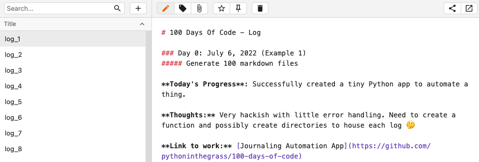
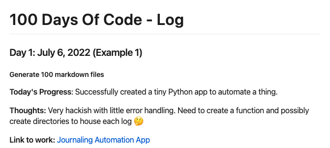

# Coding Journal (née 100-days-of-code)

## Description
> I'm looking more for a good example of content and format of a repo where someone logs their daily progress  
> I'm not looking for tools one could use - I'm looking for actual examples of coding journals done well  
— [Kimberly](https://techlahoma.slack.com/archives/C015RSYBWF3/p1657138354330209) (2022-07-06)  

We hear you, Kimberly. Until those tools exist and/or are found, this'll have to do.

## Setup
* Navigate to [the repo](https://github.com/pythoninthegrass/100-days-of-code) — you already nailed this step 🔨
* Select _Use this template_
* Create a new repo of your choosing
  * Defaults are fine
  * Public should keep you accountable, but baby steps
* After a new repo has been created, select _Code_
  * Clone > Local > HTTPS
  * Copy the URL
  * Clone via the terminal (cf. [Git Tutorial](https://www.w3schools.com/git/))
    ```bash
    mkdir -p ~/git
    git clone https://github.com/username/100-days-of-code.git
    ```
* Install either [Notable](https://notable.app/) (free) or [Typora](https://typora.io/) (one-time fee of $15)
  * I prefer the latter, but we'll demo with Notable

## Usage
* Work on something [programming-related](http://100daysofcode.com/)
* Open Notable
* Change Data Directory > Select `~/git/100-days-of-code/notes`
* Select the edit icon (✏️) on the menu bar  

* Read up on [Github Flavored Markdown](https://docs.github.com/en/get-started/writing-on-github/getting-started-with-writing-and-formatting-on-github/basic-writing-and-formatting-syntax)
* Jot down some notes from your day  
  
* Click the pencil again to stop editing  
  
* Commit to your repo
    ```bash
    git status
    git add notes/log_1.md
    git commit -m "Create log_1.md" -m "First day of 100 days of code!! 🎉"
    git push -u origin main
    ```
* Rinse/repeat x100. (At least!)

## BONUS
* Regenerate the 100 template markdown files
    ```bash
    rm notes/*.md
    cd app
    python main.py
    ```

## TODO
**MVP**
* ~~100 copies for each day with boilerplate~~
* `README.md`
  * Use template
  * Edit in desktop app (~~Notable~~, Typora, VSCode, etc)
  * ~~Inspiration/links for getting started~~

**Stretch Goals**  
* ~~Automate with a programming language and document as day one (of thousands lmao)~~
  * Don't use python for ^^ 🐍
  * And/or use ~~python~~ and go


## Resources
### 100 Days of Code
* Check out [the Official Site](http://100daysofcode.com/) for the #100DaysOfCode movement. Connect with others on the platform of your choice from this list: www.100DaysOfCode.com/connect
    Also, [here](https://www.100daysofcode.com/slack) is a invite link to the 100DaysOfCode Slack channel
* Read [Join the #100DaysOfCode](https://medium.freecodecamp.com/join-the-100daysofcode-556ddb4579e4)
* Fork this repo and commit to the [Log](src/log.md) or to the Alternative, rapid [R1 Log](src/r1-log.md) (R1 stands for Round 1) daily. [Example](https://github.com/Kallaway/100-days-kallaway-log).
